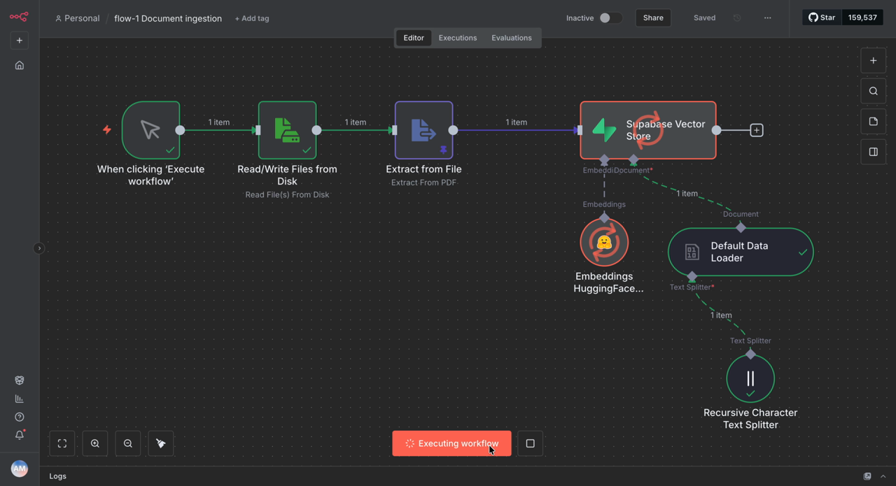
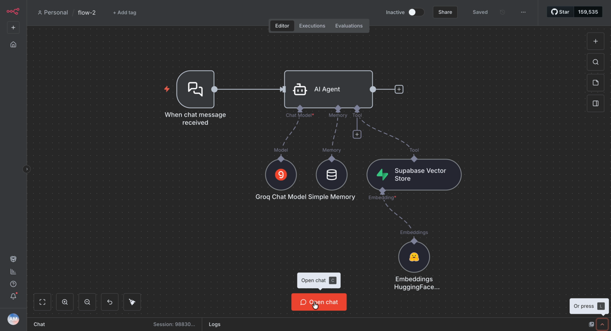
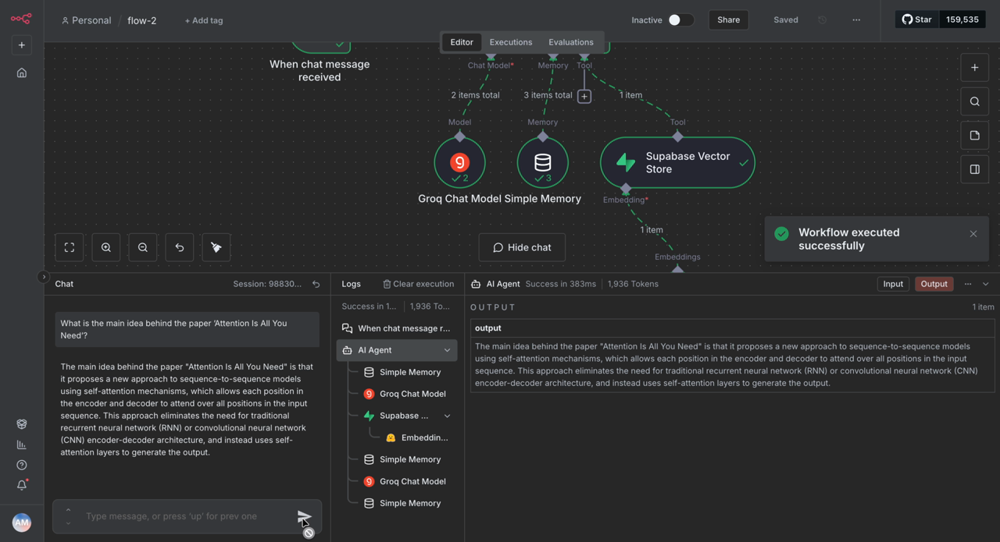

# RAG Chatbot with n8n, Supabase, HuggingFace and Groq

A Retrieval-Augmented Generation (RAG) system built in n8n (November 2025). It reads a PDF, splits it into chunks, embeds them, and stores them in a Supabase vector database. An AI agent then answers questions about the document, using **only** what it retrieves.

The demo uses the paper *Attention Is All You Need* (Vaswani et al., 2017).

▶️ **Demo video:** [`docs/demo.mp4`](docs/demo.mp4)

## Architecture

```
Flow 1: Document ingestion
  Manual trigger → Read PDF from disk → Extract text
        → Recursive Character Text Splitter → HuggingFace embeddings
        → Supabase Vector Store (insert into `documents`)

Flow 2: RAG chat agent
  Chat message → AI Agent (Groq · llama-3.1-8b-instant)
                    ├─ Simple Memory (conversation window)
                    └─ Tool: Supabase Vector Store (top-5 retrieval)
                              └─ HuggingFace embeddings
```

| Flow 1: Ingestion | Flow 2: Chat agent |
|---|---|
|  |  |

**Example answer:**



## Tech stack

| Part | Tool |
|---|---|
| Orchestration | [n8n](https://n8n.io) (self-hosted in Docker) |
| Vector database | [Supabase](https://supabase.com) + pgvector |
| Embeddings | HuggingFace Inference API |
| LLM | [Groq](https://groq.com): `llama-3.1-8b-instant` |
| Chunking | LangChain Recursive Character Text Splitter |

## Repository layout

```
workflows/
  01-document-ingestion.json   # Flow 1: PDF → chunks → embeddings → Supabase
  02-rag-chat-agent.json       # Flow 2: chat agent with retrieval tool
supabase/
  setup.sql                    # pgvector table + match_documents function
docker-compose.yml             # runs n8n locally, mounts ./files for PDFs
files/                         # put the PDF to ingest here (not committed)
docs/                          # screenshots and demo video
```

## Setup

### 1. Supabase
1. Create a free Supabase project.
2. Open **SQL Editor** and run [`supabase/setup.sql`](supabase/setup.sql).
3. Note your **Project URL** and **service_role key** (Settings → API).

### 2. API keys
- **HuggingFace:** create an access token at huggingface.co/settings/tokens
- **Groq:** create an API key at console.groq.com

### 3. Run n8n
```bash
mkdir -p files
# download the paper into files/attention.pdf, e.g.
curl -L https://arxiv.org/pdf/1706.03762 -o files/attention.pdf
docker compose up -d
```
Open http://localhost:5678 and create your n8n account.

### 4. Import the workflows
In n8n: **Workflows → Import from file**, and import both files in `workflows/`.
Then open each node that shows a warning and create its credentials:
- *Supabase account*: Project URL + service_role key
- *HuggingFaceApi account*: HuggingFace token
- *Groq account*: Groq API key

### 5. Use it
1. Open **flow-1 Document ingestion** and click **Execute workflow**. The PDF is chunked and stored in Supabase.
2. Open **flow-2** and click **Open chat**. Ask something like:
   > What is the main idea behind the paper "Attention Is All You Need"?

## How the agent stays grounded

The AI Agent's system prompt tells it to answer only from retrieved content:

> You are a research assistant. Use only retrieved document content to answer. If the information isn't present, say "I don't know". Do NOT answer from your own knowledge base, use supabase_vector_tool.

The Supabase Vector Store is attached as a **tool**, so the agent decides when to search. Each search returns the top 5 most similar chunks.

## Notes
- API keys are **not** stored in the workflow files. n8n keeps credentials separately, so you need to add your own after importing.
- To use a different document, drop it in `files/` and update the file path in the *Read/Write Files from Disk* node and the tool description in flow 2.
- If you change the embedding model, update `vector(768)` in `setup.sql` to match its output size.
